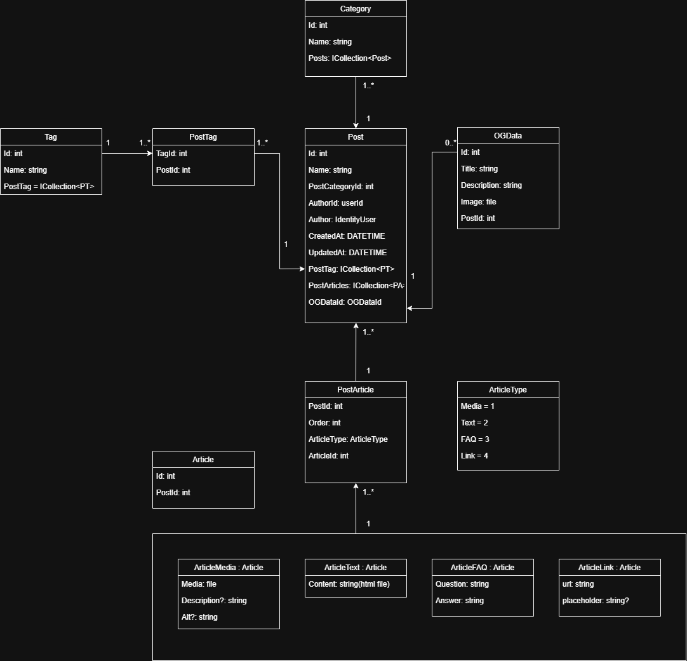

# Pixel Dread Game - Content Management System (CMS)
[https://pixeldread.com/](https://pixeldread.com/)

## Overview
This dynamic web application is built for the mobile game Pixel Dread. It features a custom Content Management System (CMS) that powers dynamic content, moving beyond a static website. The CMS enables real-time content updates and management through an admin dasboard.

The website currently includes:
- Blog
- Update log
- User login system
- Content management interface
- Privacy policy page
- Google Analytics & Cookies
- FAQ (Frequently Asked Questions)

## Technologies
- **Frontend:** React (React-router, React-Helmet), TypeScript
- **Backend:** ASP.NET Core, Entity Framework Core
- **Deployment:** Docker
- **Hosting:** VPS available at [https://pixeldread.com/](https://pixeldread.com/)

## Admin Access
Access the backend via `/admin/*` using the following test credentials:
- **Email:** test@tester.com
- **Password:** secretpassword

*Note: These are test credentials only. The database will be restructured in a future update, and these details are provided solely for testing purposes.*

